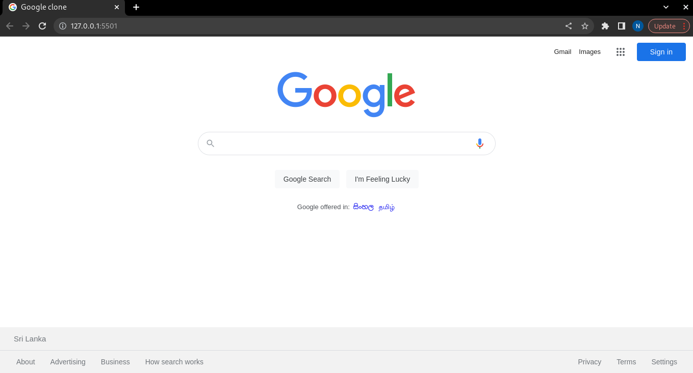

# GOOGLE CLONE
This is a clone of Google.lk UI designing for the practicing purposes using pure HTML and CSS frontend tech stack and using the knowledge of responsive web designing and programmable search engine.

## How to copy this repo
* Open the terminal at the place where we want to clone the project.
* Type the command: git clone `https://github.com/Nipuni-Jayathilaka/Google-clone.git`
* Then open the project in vscode 
* Then run the command: `npm install -g npx`
* Then run the command : `npx serve` to get the browser link for the view of the project.

### Version
0.1.0

### License
Copyright © 2022 [https://www.linkedin.com/in/nipuni-jayathilaka-ba9a72182/]Nipuni Jayathilaka. All Rights Reserved.  
This project is licensed under the [MIT](LICENSE.txt) license.

### View of the google clone

